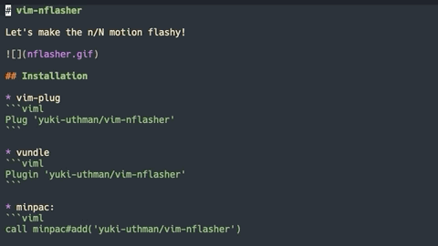
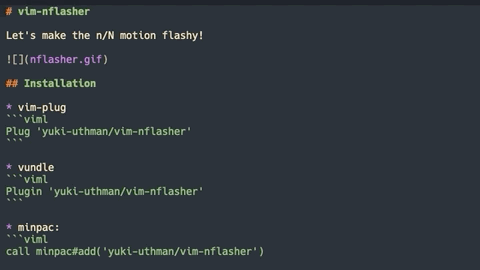
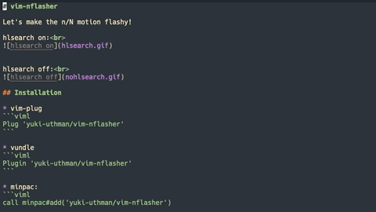

# vim-n-flasher

Let's make the n/N motion flashy!

hlsearch on:<br>



hlsearch off:<br>


## Installation

* vim-plug
```viml
Plug 'yuki-uthman/vim-n-flasher'
```

* vundle
```viml
Plugin 'yuki-uthman/vim-n-flasher'
```

* minpac:
```viml
call minpac#add('yuki-uthman/vim-n-flasher')

" for lazy loading
call minpac#add('yuki-uthman/vim-n-flasher', { 'type': 'opt' })
packadd vim-n-flasher
```

## Configuration

To disable the default mappings:
```viml
  let g:n_flasher_no_mappings = 1
```

Just use the commands below to remap to different keys:
```viml
  " the default is n/N
  nmap n <Plug>(n-flasher)
  nmap N <Plug>(N-flasher)
```
<br>
<br>


The default values are shown below:
```vimL
" the highlight group of the flash
" setting to 'Search' will make it invisible when hlsearch is turned on
let g:n_flasher_highlight = 'IncSearch'

" to see all the available highlight groups
:h highlight 

" the duration of the flash (in milliseconds)
let g:n_flasher_duration = 100

" the number of times to flash
let g:n_flasher_repeat = 3
```

If you prefer to keep the flash on:
```vimL
" the flash still goes off if you move the cursor or enter insert mode
let g:n_flasher_keep_flash = 1
```

> **_Note:_** The highlight being used is 'PmenuSel'

If you want to define your own highlight group:
```vimL
" for terminal
" ctermfg as the font color
" ctermbg as the background color
highlight flasherColor ctermfg='White' ctermbg='Black'

" for gui
" guifg as the font color
" guibg as the background color
highlight flasherColor guifg='White' guibg='Black'

let g:n_flasher_highlight = 'flasherColor'
```
The following colors are available in most systems:
  - Black
  - Brown
  - Gray
  - Blue
  - Green
  - Cyan
  - Red
  - Magenta
  - Yellow
  - White

To see more colors:
```vimL
h cterm-colors
h gui-colors
```

To set custom color using RGB:
```vimL
:highlight flasherColor guifg=#11f0c3 guibg=#ff00ff
```

## Licence

MIT Licence

